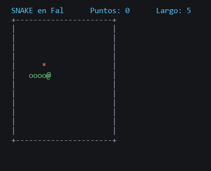

# Fal

Un lenguaje de programación en español, sin símbolos raros. Un solo ejecutable,
sin nada que instalar.

```fal
tipo Perro hereda de Animal con nombre
    funcion habla
        devuelve nombre de mi mas " dice guau"
    fin
fin

para cada p en perros
    escribe habla de p
fin
```



Eso es `ejemplos/snake.fal`, escrito entero en el lenguaje.

### [Pruébalo aquí, sin instalar nada](https://nissanboss.github.io/Fal/)

El intérprete entero corre dentro del navegador. Escribes, le das a ejecutar y ya.
Y si estás empezando, tiene **diez lecciones** con sus ejercicios, desde escribir
en pantalla hasta funciones.

No hay `;` ni `{}` ni `==` ni `+`. Los bloques cierran con `fin`, las cuentas se
escriben `3 mas 4`, y las comparaciones `si edad es mayor que 18`. Con tildes o
sin ellas, en mayúsculas o en minúsculas: da igual.

## Qué sabe hacer

Todo lo que se espera de un lenguaje de verdad: listas, diccionarios, conjuntos,
funciones que se pasan como datos, clausuras, objetos con herencia, errores con
clase, módulos, archivos, JSON, fechas, expresiones regulares e internet. Son 88
funciones y 42 palabras.

Tres cosas que lo separan de un lenguaje de juguete:

**Los decimales son exactos.** Aquí le gana a Python, a JavaScript y a Java:

```
escribe 0.1 mas 0.2              → 0.3
escribe (0.1 mas 0.2) es 0.3     → verdadero
escribe 19.99 por 3              → 59.97
```

Y no es un detalle de juguete. `ejemplos/gastos.fal` suma 23 gastos de un CSV:
Fal da **1546.19** y las categorías cuadran al céntimo. Las mismas sumas en
coma flotante dan **1546.1900000000005**, que no cuadra con la suma de sus
partes. Con dinero, eso es un descuadre en el arqueo.

**Los errores enseñan.** Dicen la línea, por dónde pasó el programa y cómo se
arregla:

```
  X  No conozco nada llamado "nombree".
     linea 2 |  escribe nombree
     Pista: Quizas querias decir "nombre".
```

**Trae de todo dentro.** El mismo ejecutable corre tus programas, pasa su propio
banco de pruebas (`fal --probar`) y genera el coloreado para VS Code
(`fal --editor`).

## Dibujar

Un bucle que dibuja se entiende mejor que un bucle que escribe números. La tortuga
es un lápiz que se arrastra por la pantalla: `camina` la mueve hacia donde mira y
`gira` la tuerce.

```
repite 36 veces
    camina de 100
    gira de 170
fin
```

Cuatro líneas y sale una estrella de 36 puntas. En el navegador aparece debajo del
texto; desde la terminal se guarda en un `.svg` junto a tu programa.

Está en `ejemplos/dibujo.fal`.

## Descargar

Coge el paquete de tu sistema en la [página de versiones](../../releases),
descomprímelo entero y ejecuta el instalador que viene dentro.

| Tu sistema | Paquete | Instalador |
|---|---|---|
| Windows | `fal-windows.zip` | doble clic en `instalar.bat` |
| Mac con chip Apple | `fal-mac-apple.tar.gz` | `sh instalar.sh` |
| Mac con Intel | `fal-mac-intel.tar.gz` | `sh instalar.sh` |
| Linux | `fal-linux.tar.gz` | `sh instalar.sh` |
| Linux en ARM | `fal-linux-arm.tar.gz` | `sh instalar.sh` |

No hace falta ser administrador. Si tu sistema avisa de que el programa no está
firmado, mira [LEEME](LEEME.md#si-tu-sistema-bloquea-el-programa).

## Primer programa

Guarda esto como `hola.fal`:

```fal
nombre es pregunta "¿Cómo te llamas?"
escribe "Hola " mas nombre

si largo de nombre es mayor que 5
    escribe "Tienes un nombre largo"
fin
```

Y ejecútalo:

```bash
fal hola.fal
```

## Ejemplos

Vienen en el paquete, en la carpeta `ejemplos`:

| Archivo | Qué enseña |
|---|---|
| `hola.fal` | Variables, condiciones, repetir |
| `dibujo.fal` | La tortuga: un bucle que dibuja en vez de escribir |
| `listas.fal` | Listas, bucles, funciones |
| `adivina.fal` | Un juego con `pregunta` y `mientras` |
| `completo.fal` | Recorrido por lo básico |
| `agenda.fal` | Objetos, archivos y un menú |
| `avanzado.fal` | Clausuras, herencia, JSON, fechas, internet |
| `snake.fal` | El juego de la serpiente |
| `gastos.fal` | Analiza un CSV de gastos y saca un informe |
| `cifrado.fal` | Cifra un mensaje y luego lo rompe sin saber la clave |
| `romanos.fal` | Numeros romanos de ida y vuelta, y comprueba los 3999 |
| `hanoi.fal` | Las torres de Hanoi, para ver que es la recursion |

```bash
fal ejemplos/snake.fal
```

```
 SNAKE en Fal      Puntos: 60      Largo: 11
 +----------------------+
 |             @        |
 |             o *      |
 |             o        |
 |           ooo        |
 +----------------------+
```

## Documentación

- **[LEEME.md](LEEME.md)**: instalar, desinstalar y poner el color en el editor
- **[MANUAL.md](MANUAL.md)**: el lenguaje entero, con una tabla de traducción
  desde Python y JavaScript al final

## Compilar tú mismo

Solo hace falta [Go](https://go.dev):

```bash
go build -o fal .
```

```bash
sh construir.sh
```

Lo primero compila para tu sistema. Lo segundo prepara los cinco paquetes, y se
niega a hacerlo si las pruebas no pasan.

Añadir una función al lenguaje es una entrada más en la tabla de
`biblioteca.go`. No hay que tocar ni el lector ni el armador.

## Licencia

MIT. Haz lo que quieras con él.
